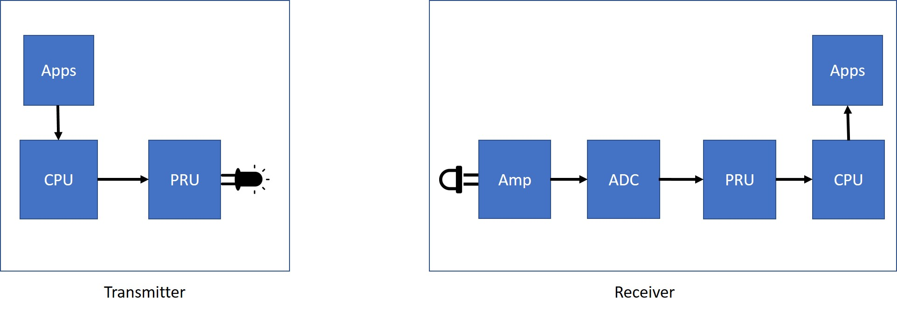

# Project Description.
In this project, students are going to build a simple LED-to-Photodiode communication system that can transmit "hello world"
message from the tranmitter to the receiver. The overall data flow for this project is shown in the following figure.

# What you will learn from this project.
* Students will learn practical skills working under Linux Environment.
* Students will learn basic Linux commands.
* Students will learn how practical wireless communication system works.
* Students will learn basic modulation technique.
* Students will learn how to improve optic communication performance.
* Students will learn how to communicate between kernel and userspace.
* Students will learn how to encode and decode packets in PHY layer.
* Students will learn how to compile and debug Assembly/C program under Linux.
# What do you need to do in the project.

